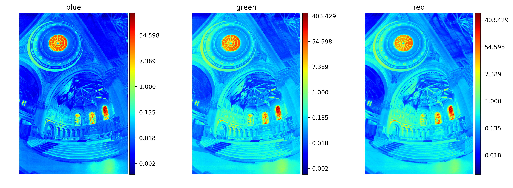
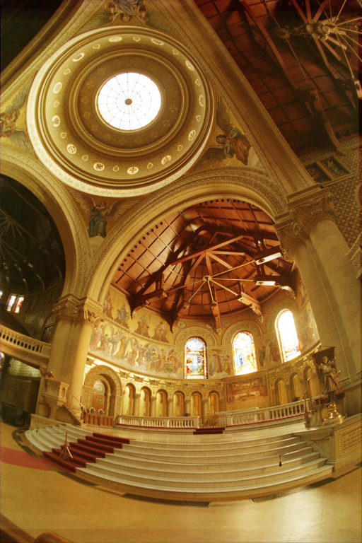
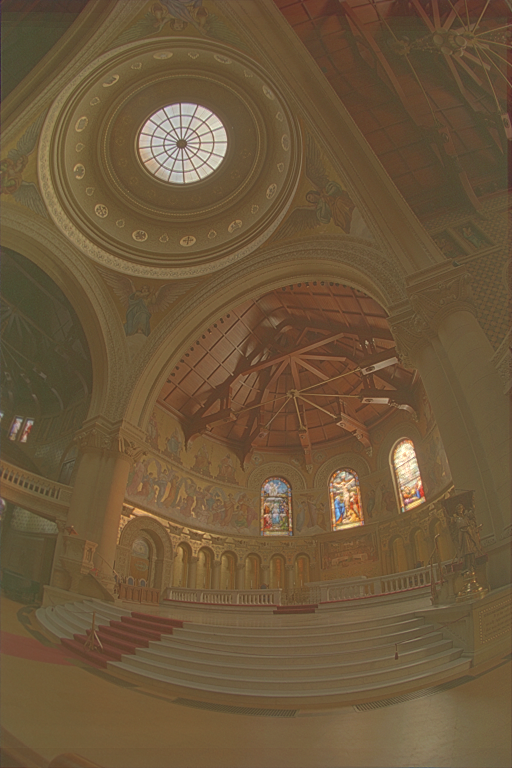
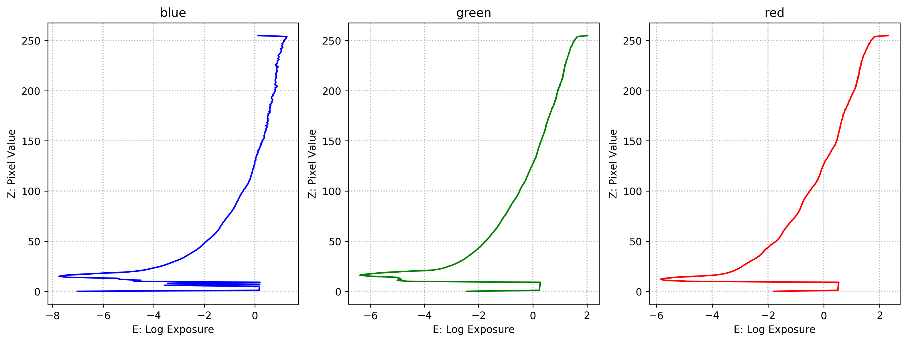
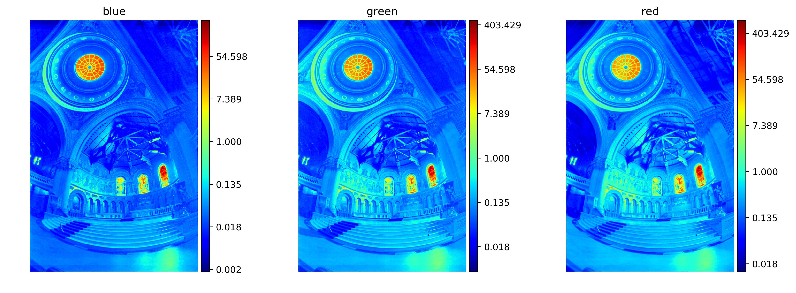
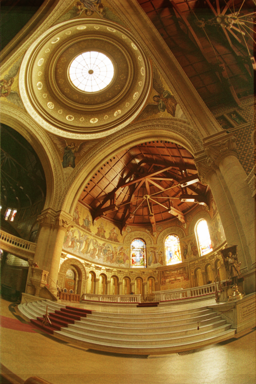
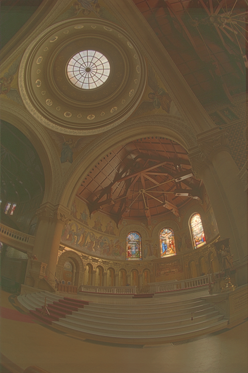
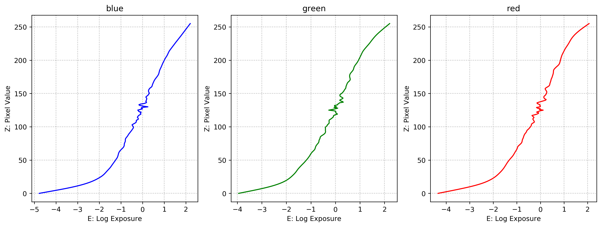
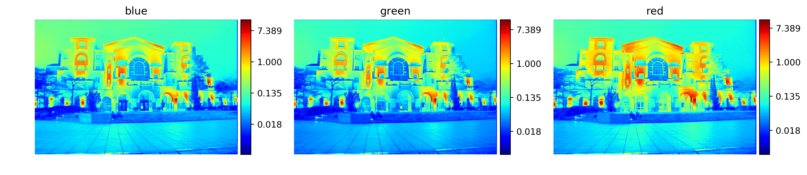

# VFX Project 1 - HDR Imaging

## 0. Team Members
* R07944007 林良翰
* R07922100 楊力權

## 1. Program Usage

### 1.1. Quick Usage

* Input directory

```
[input_directory]/
├──[image1]
├──...
└──shutter_times.txt
```

* Example of shutter_times.txt

```
32
16
8
4
2
1
1/2
1/4
1/8
1/16
1/32
1/64
1/128
1/256
1/512
1/1024
```

* Run

```
python3 hdr.py [input_directory] --savedir [output_directorp]    
```
### 1.2. Advanced Usage

* Please check the program document.

```
python3 hdr.py --help
```

## 2. Code Works

### 2.1. Image Alignment

* MTB Algorithm  
  Instead of using median threshold bitmap, we used gradient magnitude to compare the differences.

### 2.2. HDR Reconstruction

* Debevec's Method
* Robertson's Method

### 2.3. Tone Mapping

* Photographic

  * Global Operator
  * Local Operator
  
* Bilateral
  We implemented opencv bilateral filtering to complete this algorithm.

## 3. Comparison

* Input Images - `data/memorial`

### 3.1. Debevec's Method

* Response Curve

  

* Radiance

  

* Tonemapping

| Photographic Global Operator | Photographic Local Operator | Bilateral |
| :--------------------------: | :-------------------------: | :-------: |
|  |  |  |

### 3.2. Robertson's Method

* Response Curve

  

* Radiance

  

* Tonemapping

| Photographic Global Operator | Photographic Local Operator | Bilateral |
| :--------------------------: | :-------------------------: | :-------: |
|  |  |  |

## 4. Our HDR Photo

* Input Images - `data/ntu-library`

### 4.1. Parameter

* Image Alignment

  * depth = $5$

* Debevec's Method

  * $\lambda = 10$

* Photographic Local Operator

  * $a=0.25$
  * $\delta=10^{-6}$

### 4.2. Result

* Response Curve - `data/ntu-library/res/debevec/response_curve.png`

  

* Radiance - `data/ntu-library/res/debevec/radiance.hdr`

  

* Tonemapping - `data/ntu-library/res/debevec/tonemap_local.png`

  
